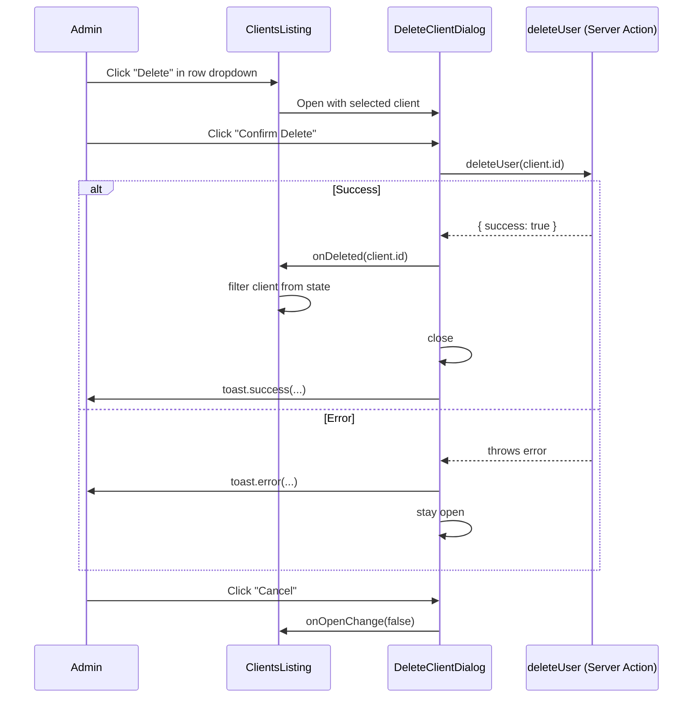

# Design Document: Client Listing Delete Button

## Overview

This feature adds a delete action to the existing Actions column dropdown in the `ClientsListing` component at `/dashboard/users/clients`. When an administrator selects "Delete" from a client row's dropdown, a confirmation dialog opens showing the client's name and email along with a permanence warning. On confirmation, the existing `deleteUser` server action is called, and on success the client is removed from local React state, the dialog closes, and the stats counters update automatically.

The change is entirely contained within the `client-listing.tsx` component file — no new routes, no new server actions, and no changes to the page-level data fetching are required.

## Architecture

The feature follows the existing client-side state management pattern already used in `ClientsListing` for the approve flow:

```
User clicks "Delete" in dropdown
  → deleteTarget state set to client
  → DeleteClientDialog renders (open=true)
    → User confirms
      → deleteUser(client.id) server action called
        → Success: remove from clients state, close dialog, toast success
        → Error: toast error, dialog stays open
    → User cancels
      → deleteTarget state cleared, dialog closes
```

No new server actions are needed. The existing `deleteUser` in `actions/auth.ts` already handles the authenticated DELETE request and calls `revalidatePath`.



## Components and Interfaces

### `DeleteClientDialog` (new, co-located in `client-listing.tsx`)

A self-contained dialog component following the same pattern as `DeleteUserPortfolioDialog`.

```typescript
type DeleteClientDialogProps = {
  open: boolean;
  client: Client | null;
  onOpenChange: (open: boolean) => void;
  onDeleted: (clientId: string) => void;
};
```

Internally manages:
- `isDeleting: boolean` — tracks in-flight state, disables buttons and shows spinner

### `ClientsListing` changes

Two new state variables added to the existing component:

```typescript
const [deleteTarget, setDeleteTarget] = useState<Client | null>(null);
```

New handler:
```typescript
function handleDeleted(clientId: string) {
  setClients((prev) => prev.filter((c) => c.id !== clientId));
  setDeleteTarget(null);
}
```

The dropdown in each row gains a new destructive `DropdownMenuItem` that calls `setDeleteTarget(client)` and stops row-click propagation (already handled by the existing `onClick={(e) => e.stopPropagation()}` on the Actions cell).

## Data Models

No new data models. The existing `Client` type already contains all fields needed (`id`, `firstName`, `lastName`, `email`).

The stats counters (`total`, `approved`, `pending`, `withOnboarding`) are derived values computed directly from the `clients` state array on every render, so they update automatically when a client is removed — no additional logic required.

```typescript
// These already exist and will auto-update after deletion:
const total = clients.length;
const approved = clients.filter((c) => c.isApproved).length;
const pending = clients.filter((c) => !c.isApproved).length;
const withOnboarding = clients.filter(
  (c) => c.individualOnboarding || c.companyOnboarding
).length;
```

## Correctness Properties

*A property is a characteristic or behavior that should hold true across all valid executions of a system — essentially, a formal statement about what the system should do. Properties serve as the bridge between human-readable specifications and machine-verifiable correctness guarantees.*

### Property 1: Delete option present for every client row

*For any* non-empty list of clients rendered in `ClientsListing`, every row's Actions dropdown must contain a "Delete" menu item.

**Validates: Requirements 1.1**

### Property 2: Delete dialog opens with correct client data

*For any* client in the rendered list, clicking the delete option for that client must open the `DeleteClientDialog` displaying that client's full name and email, and must include a permanence warning.

**Validates: Requirements 1.2, 1.3, 4.3**

### Property 3: Row click is suppressed while delete dialog is open

*For any* client row, when the delete dialog is open for that client, clicking the row must not open the client detail dialog.

**Validates: Requirements 1.4**

### Property 4: Confirmation triggers delete action with correct id

*For any* client, clicking confirm in the `DeleteClientDialog` must call `deleteUser` exactly once with that client's `id`, and must not call it before the confirm button is clicked or when cancel is clicked.

**Validates: Requirements 2.1, 2.2, 2.3**

### Property 5: Loading state disables interaction

*For any* in-progress delete operation, the `DeleteClientDialog` must show a loading spinner and both the confirm and cancel buttons must be disabled.

**Validates: Requirements 2.4**

### Property 6: Error keeps dialog open with toast

*For any* error thrown by `deleteUser`, the `DeleteClientDialog` must remain open and `toast.error` must be called.

**Validates: Requirements 2.5, 4.2**

### Property 7: Successful deletion updates all UI state

*For any* client successfully deleted, the `ClientsListing` must: remove that client from the `clients` array, close the delete dialog, call `toast.success`, and the derived stats counters must reflect the updated array.

**Validates: Requirements 3.1, 3.2, 3.3, 3.4**

## Error Handling

| Scenario | Behavior |
|---|---|
| `deleteUser` throws (network, 5xx) | `toast.error("Failed to delete client. Please try again.")`, dialog stays open, `isDeleting` reset to `false` |
| `deleteUser` throws with 401/403 | Same as above — the thrown error message is surfaced in the toast |
| User cancels mid-flight | Not possible — buttons are disabled while `isDeleting` is true |
| `deleteTarget` is null when dialog renders | Dialog renders nothing (`if (!client) return null`) |

The `deleteUser` server action already throws on error (it does not return `{ error }` — it throws), so the dialog wraps the call in `try/catch`.

## Testing Strategy

### Unit Tests

Focus on specific examples and edge cases:

- Render `ClientsListing` with one client → dropdown contains "Delete" item
- Render `DeleteClientDialog` with a client → displays client name, email, and permanence warning text
- Click cancel → `onOpenChange(false)` called, `deleteUser` not called
- `deleteUser` mock throws → `toast.error` called, `onDeleted` not called

### Property-Based Tests

Use a property-based testing library (e.g., `fast-check` for TypeScript/Jest) with a minimum of 100 iterations per property.

Each test is tagged with the property it validates:
> Tag format: `Feature: client-listing-delete-button, Property {N}: {property_text}`

**Property 1 test** — `Feature: client-listing-delete-button, Property 1: Delete option present for every client row`
Generate an arbitrary array of `Client` objects, render `ClientsListing`, and assert every row's dropdown contains a delete item.

**Property 2 test** — `Feature: client-listing-delete-button, Property 2: Delete dialog opens with correct client data`
Generate an arbitrary `Client`, simulate clicking its delete option, assert the dialog contains `firstName + lastName` and `email` and permanence warning text.

**Property 3 test** — `Feature: client-listing-delete-button, Property 3: Row click suppressed while delete dialog open`
Generate an arbitrary `Client`, open the delete dialog for it, simulate a row click, assert the detail dialog does not open.

**Property 4 test** — `Feature: client-listing-delete-button, Property 4: Confirmation triggers delete action with correct id`
Generate an arbitrary `Client`, render the dialog, assert `deleteUser` not called on open, simulate confirm click, assert `deleteUser` called once with `client.id`. Separately assert cancel does not call `deleteUser`.

**Property 5 test** — `Feature: client-listing-delete-button, Property 5: Loading state disables interaction`
Mock `deleteUser` to never resolve, simulate confirm click, assert spinner visible and both buttons have `disabled` attribute.

**Property 6 test** — `Feature: client-listing-delete-button, Property 6: Error keeps dialog open with toast`
Generate an arbitrary error message, mock `deleteUser` to throw it, simulate confirm, assert dialog still open and `toast.error` called.

**Property 7 test** — `Feature: client-listing-delete-button, Property 7: Successful deletion updates all UI state`
Generate an arbitrary array of clients, pick one to delete, mock `deleteUser` to resolve, simulate confirm, assert: deleted client absent from rendered rows, dialog closed, `toast.success` called, stats counters match the updated array length.
